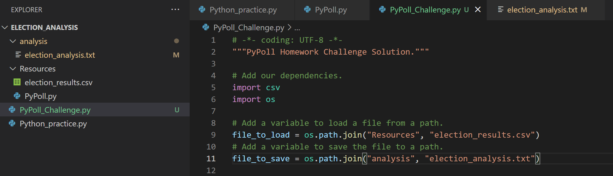
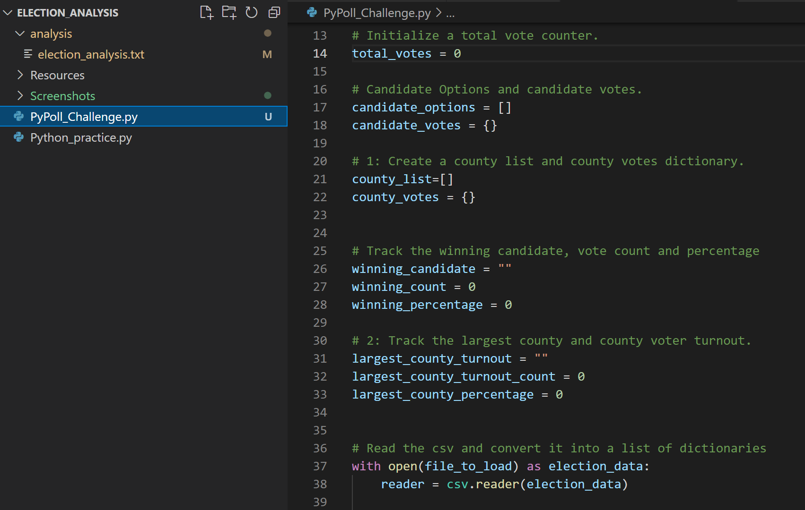
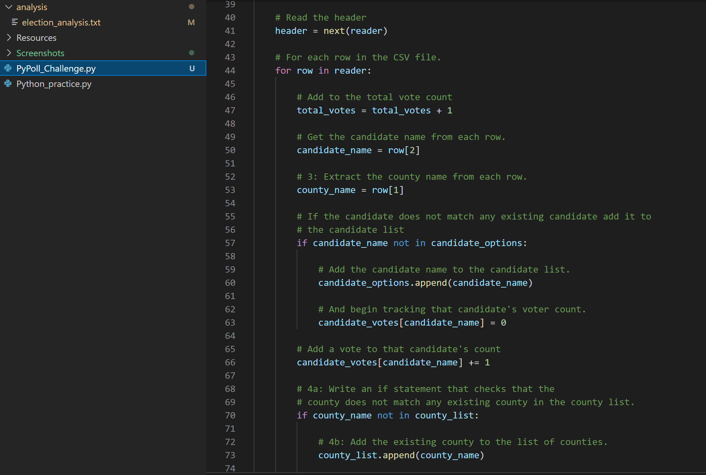
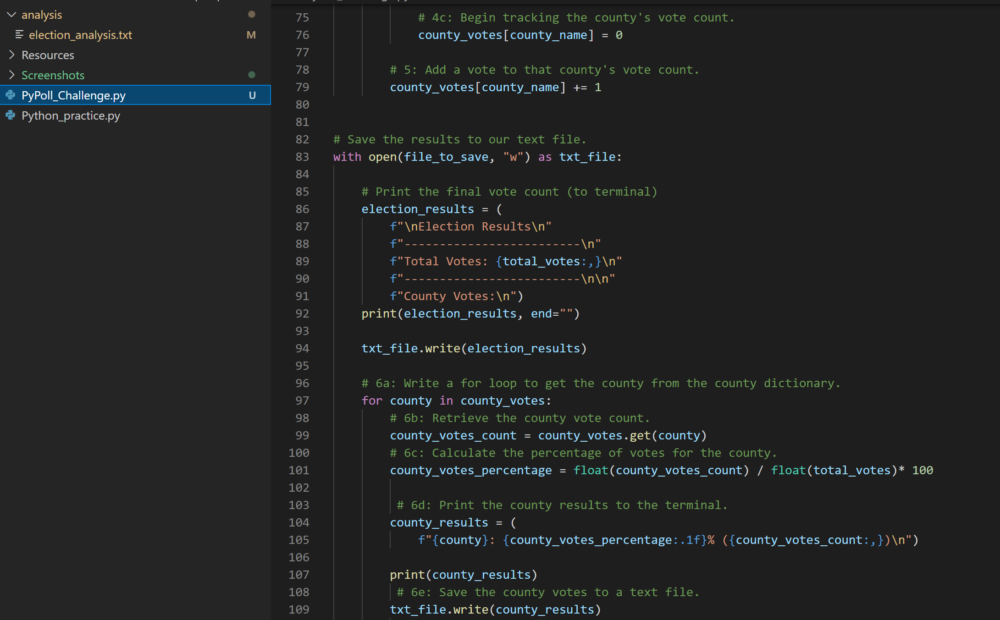
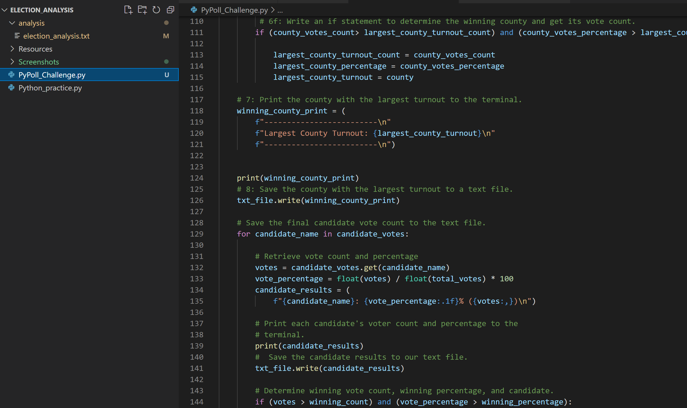
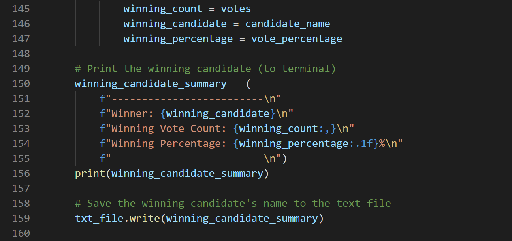
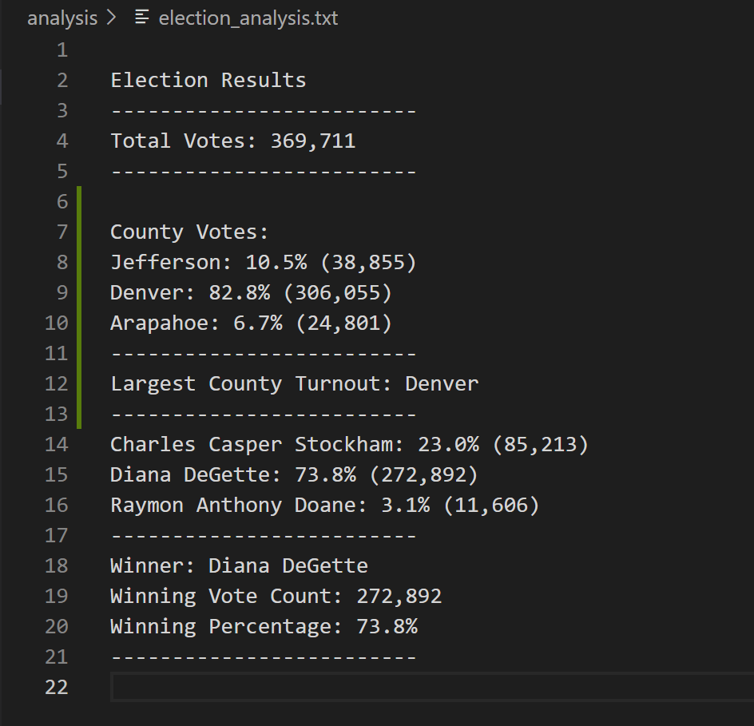

# election-analysis
Auditing Colorado Election
## Overview of Election Audit
The purpose of this election audit is to analysize the total number of votes, number of voter turnout in each county, percentage of votes from each county out of the total count, county with the highest turnout, number of votes and percentage of votes each candidates and the statistic of the winner candidate. 
## Election-Audit Results
### Setting up our inital data file 
First by adding a variable "file_to_load" we load a data file from a path that we will be working with to get the election results. Then by creating a variable "file_to_save" we created a path to a text file where we will save our data analysis result. 

### The code used in the analysis

## Results
* ### How many votes were cast in this congressional election?

There were total votes of 369,711

* ### Provide a breakdown of the number of votes and the percentage of total votes for each county in the precinct.

There were three counties in the election data. The counties were Jefferson, Denver, and Arapahoe. The county with the highest number of votes is Denver with 306,055 votes, which is 82.8% of the total votes. The second highest county votes is Jefferson with 38,855 votes, which is 10.5% of the total votes. The third is Arapahoe with 24,801 votes, which is 6.7% of the total votes.

* ### Which county had the largest number of votes?

The largest county turnout is Denver.

* ### Provide a breakdown of the number of votes and the percentage of the total votes each candidate received.

The three candidates in this election race were Charles Casper Stockham, Diana DeGette and Raymon Anthony Doane. The candidate Diana DeGette has the most votes with 272,892 count which is 73.8% of the total votes. The second most voted candidate is Charles Casper Stockham with 85,213 votes which is 23% of the total votes. In the third place, candidate Raymon Anthony Doane received 11,606 votes which is 3.1% of the total votes.

* ### Which candidate won the election, what was their vote count, and what was their percentage of the total votes?

The winner candidate was Diana DeGette with the vote count of 272,892 which was 73.8% of the toatl vote. 

## Election-Audit Summary

